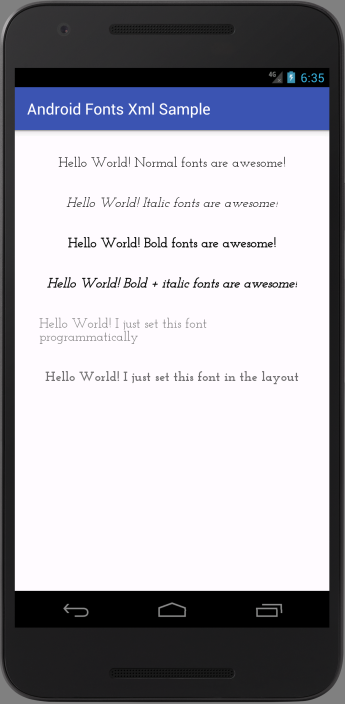

# Android Fonts XML Sample

This sample demonstrates the xml fonts feature of Support Library 26 as a way of backporting
the feature introduced in Android Oreo (API level 26) all the way to API level 14.

This is sample code for the post at https://segunfamisa.com/posts/custom-fonts-with-android-support-library

Screenshot of the final app is shown below:

## Requirements
* Android Studio 3.0
* Build Tools 26.0.1
* Gradle 4.1
* AS Gradle Plugin version 3.0.0-beta2

